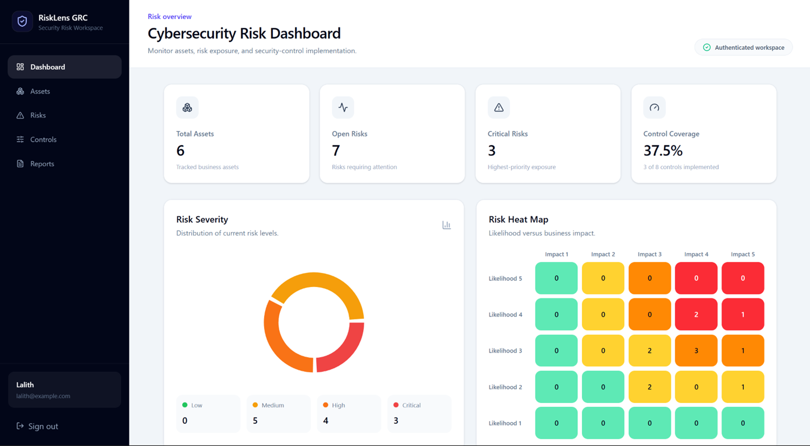
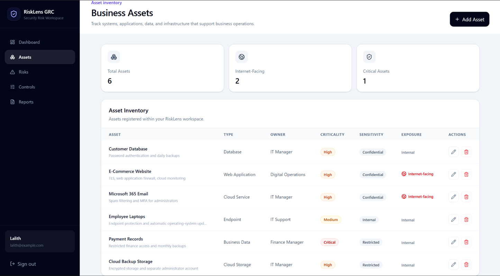
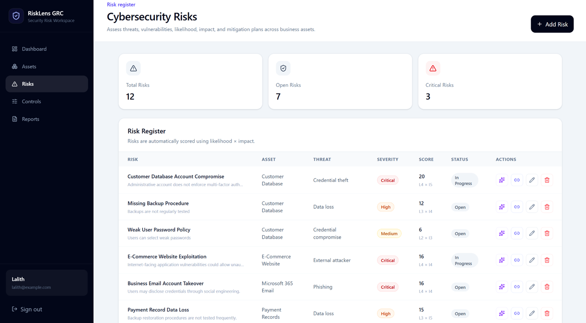
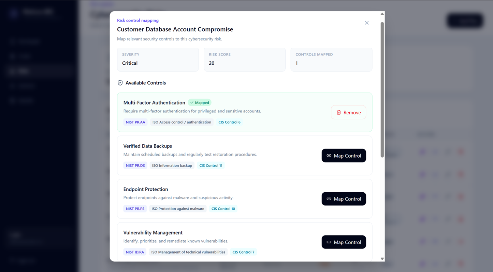
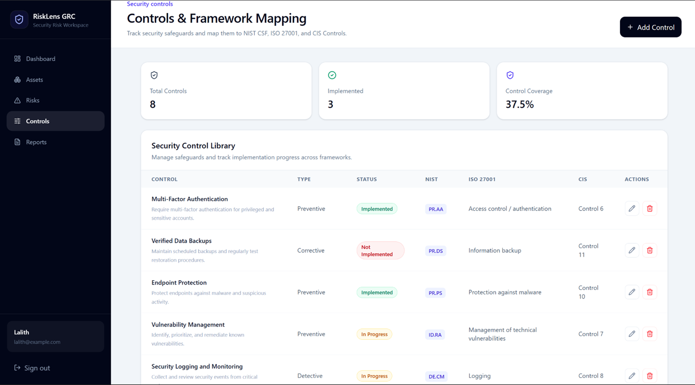
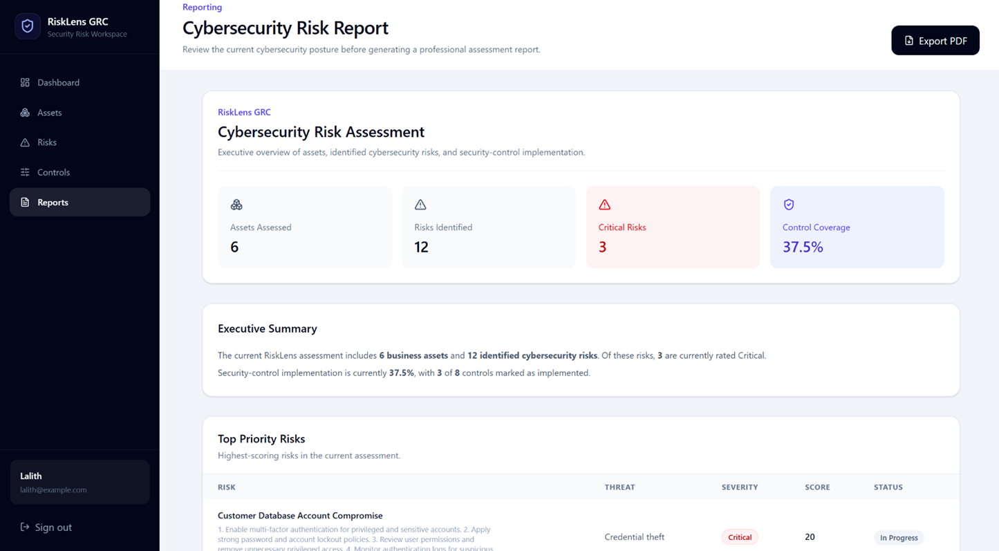
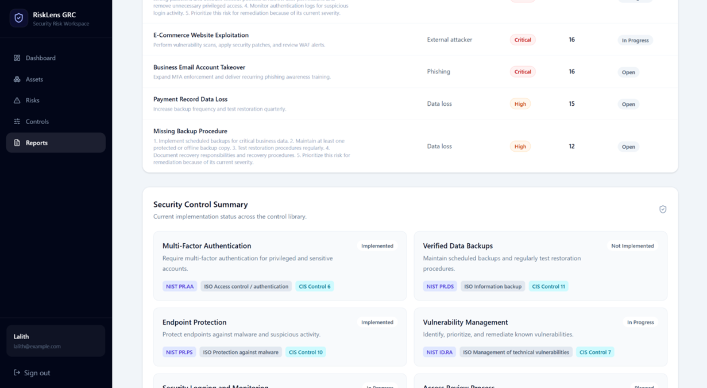
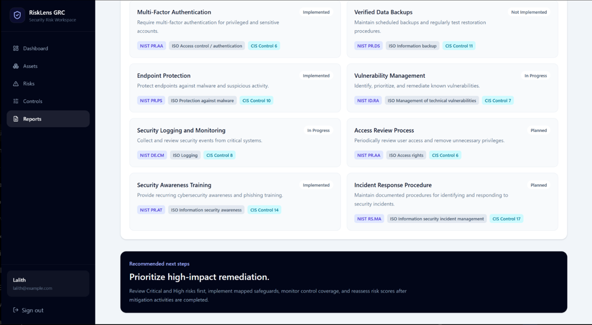
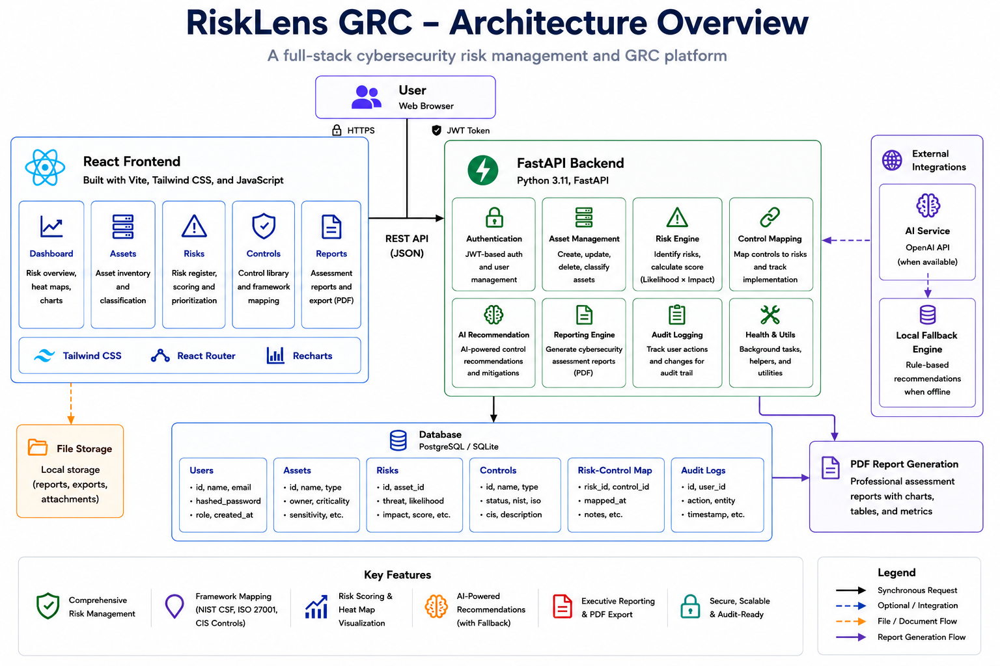

# RiskLens GRC


**RiskLens GRC** is a full-stack cybersecurity Governance, Risk, and Compliance platform designed to help organizations identify assets, assess cybersecurity risks, track security controls, map safeguards to recognized security frameworks, and generate actionable cybersecurity assessment reports.


The platform combines traditional GRC workflows with AI-assisted mitigation recommendations while providing a local fallback recommendation engine when the external AI service is unavailable.


---


## Dashboard





RiskLens provides a centralized cybersecurity risk dashboard for monitoring an organization's current security posture.


The dashboard provides visibility into:


- Total tracked assets

- Open cybersecurity risks

- Critical risks

- Overall risk distribution

- Security control coverage

- Likelihood × impact risk heat map

- Priority cybersecurity risks


---


## Key Features


### Asset Management


RiskLens provides a structured asset inventory for identifying systems and resources that may introduce cybersecurity risk.


Assets can contain information such as:


- Asset name

- Asset type

- Asset owner

- Business criticality

- Data sensitivity

- Internet-facing exposure

- Existing safeguards





Maintaining an asset inventory establishes the foundation for the risk assessment process because identified cybersecurity risks can be associated with specific organizational assets.


---


### Cybersecurity Risk Register


RiskLens includes a centralized cybersecurity risk register for documenting, assessing, and tracking security risks.


Each risk can include information such as:


- Risk title

- Associated asset

- Threat

- Vulnerability

- Likelihood

- Impact

- Calculated risk score

- Severity

- Risk status

- Mitigation information


Risk scores are automatically calculated using a likelihood × impact methodology.





This allows higher-risk issues to be identified and prioritized for remediation.


---


### Risk-Control Mapping


Security controls can be mapped directly to identified cybersecurity risks.


This allows RiskLens to show which safeguards are being used to reduce specific risks and helps identify areas where additional controls may be required.





Risk-control mapping connects the risk assessment process with the organization's security-control implementation strategy.


---


### Security Control Management


RiskLens contains a centralized security control inventory for tracking safeguards used by the organization.


Controls can be classified and monitored using information such as:


- Control name

- Control type

- Implementation status

- Framework mapping

- Associated risks





Implementation states allow organizations to distinguish between controls that are implemented, in progress, or not yet implemented.


---


## Framework Alignment


RiskLens maps security controls to recognized cybersecurity frameworks.


The current implementation supports mappings across:


- **NIST Cybersecurity Framework**

- **ISO/IEC 27001**

- **CIS Controls**


Framework mappings provide a lightweight way to connect operational cybersecurity safeguards with recognized governance and security-control frameworks.


This allows the same control to demonstrate how it relates to multiple cybersecurity standards.


---


## Cybersecurity Assessment Reports


RiskLens automatically creates a cybersecurity assessment report based on the organization's current assets, risks, and controls.


The report provides management-level visibility into the organization's cybersecurity posture.


It includes:


- Assessment metrics

- Executive summary

- Priority cybersecurity risks

- Risk scores and severity

- Risk treatment status

- Security-control implementation

- Framework mappings

- Overall control coverage


Reports can also be exported as PDF documents.





### Priority Risk Analysis


RiskLens prioritizes significant cybersecurity risks so that remediation efforts can focus on the areas presenting the greatest exposure.





### Security Control Assessment


The report also provides visibility into implemented and planned safeguards together with their cybersecurity framework mappings.





---


## AI-Assisted Risk Mitigation


RiskLens includes AI-assisted mitigation recommendations for identified cybersecurity risks.


Structured risk information can be sent to an external AI service to generate contextual mitigation guidance.


Information considered by the recommendation workflow can include:


- Asset information

- Threat

- Vulnerability

- Likelihood

- Impact

- Risk score

- Risk severity

- Existing safeguards


The goal is to provide practical mitigation suggestions that can assist users when determining how a cybersecurity risk should be treated.


### Local Fallback Recommendation Engine


RiskLens also contains a local fallback recommendation mechanism.


If the external AI service becomes unavailable because of circumstances such as:


- Missing API credentials

- API quota exhaustion

- Connectivity problems

- External service errors


the application can still provide deterministic cybersecurity mitigation guidance.


This design ensures that the core risk-management workflow does not depend entirely on an external AI provider.


---


## Risk Scoring Model


RiskLens uses a likelihood × impact risk-scoring methodology.


```text

Risk Score = Likelihood × Impact

```


Likelihood and impact are rated on a **1–5 scale**.


For example:


```text

Likelihood = 4

Impact = 5


Risk Score = 4 × 5 = 20

```


The resulting score is converted into a risk severity.


| Risk Score | Severity |
|---|---|
| 1–5 | Low |
| 6–10 | Medium |
| 11–15 | High |
| 16–25 | Critical |


This approach allows cybersecurity risks to be prioritized consistently according to their probability and potential business impact.


Risk scores are also represented visually through the dashboard risk heat map.


---


# Architecture





RiskLens follows a full-stack client-server architecture.


The React frontend communicates with the FastAPI backend through REST API requests.


The backend is responsible for application business logic including:


- Authentication

- Asset management

- Risk management

- Risk scoring

- Security control management

- Risk-control mapping

- Dashboard analytics

- Reporting

- Audit logging

- AI-assisted mitigation recommendations


The database stores the application's persistent GRC information.


External AI integration is isolated behind the backend rather than being called directly from the browser.


---


## Technology Stack


### Frontend


- React

- JavaScript

- Vite

- Tailwind CSS

- Axios

- React Router

- Recharts

- Lucide React


### Backend


- Python

- FastAPI

- Pydantic

- SQLAlchemy

- REST API

- JWT authentication

- OpenAI API integration


### Database


- SQLite for local development

- PostgreSQL-ready architecture for future production deployment


### Security


- JWT-based authentication

- Password hashing

- Protected API routes

- Environment-based secret management

- CORS configuration

- User-specific data access

- Audit logging


---


# Authentication and Authorization


RiskLens includes user registration and authentication functionality.


After successful authentication, the backend issues a signed JWT access token.


The frontend uses this token when communicating with protected backend endpoints.


The authentication workflow can be summarized as:


```text

User Login

&#x20;   ↓

Credentials sent to FastAPI

&#x20;   ↓

Password verification

&#x20;   ↓

JWT access token generated

&#x20;   ↓

Token returned to frontend

&#x20;   ↓

Token included with protected API requests

&#x20;   ↓

Backend validates token

&#x20;   ↓

Authorized resource access

```


Protected API endpoints validate the authenticated user before allowing access to application resources.


This helps ensure that GRC information is associated with the appropriate authenticated user.


---


# Audit Logging


RiskLens includes audit logging for important application actions.


Audit records provide traceability for changes made within the GRC platform.


Examples of auditable activity include:


- Asset creation

- Asset modification

- Asset deletion

- Risk creation

- Risk modification

- Risk deletion

- Control changes

- Risk-control mapping activity


Audit logging is an important GRC capability because it provides accountability and helps establish a historical record of security-related changes.


---


# PDF Reporting


Cybersecurity assessment information can be exported into a PDF report.


This allows assessment results to be shared outside the application with stakeholders such as:


- Management

- Security teams

- IT teams

- Risk owners

- Auditors


The exported report provides a portable representation of the organization's current cybersecurity risk posture.


---


# Project Structure


```text

RiskLens-GRC/

│

├── backend/

│   ├── app/

│   ├── .env

│   ├── .env.example

│   ├── requirements.txt

│   └── seed_demo.py

│

├── docs/

│   └── screenshots/

│       ├── 1-dashboard.png

│       ├── 2-assets.png

│       ├── 3-risks.png

│       ├── 4-control-mapping.png

│       ├── 5-controls.png

│       ├── 6-reports-overview.png

│       ├── 7-reports-priority-risks.png

│       ├── 8-reports-controls.png

│       └── ArchitectureImage.png

│

├── frontend/

│   ├── public/

│   ├── src/

│   ├── .gitignore

│   ├── eslint.config.js

│   ├── index.html

│   ├── package-lock.json

│   ├── package.json

│   ├── README.md

│   └── vite.config.js

│

├── sample-data/

├── screenshots/

├── .env

├── .env.example

├── .gitignore

├── docker-compose.yml

└── README.md

```


Generated or sensitive directories such as `node_modules`, Python virtual environments, `.env` files, build artifacts, and local database files should not be committed to source control.


---


# Running RiskLens Locally


## Prerequisites


Before running RiskLens, install:


- Python 3

- Node.js

- npm

- Git


---


## 1. Clone the Repository


```bash

git clone <repository-url>

cd RiskLens-GRC

```


Replace `<repository-url>` with the GitHub repository URL.


---


## 2. Backend Setup


Navigate to the backend directory:


```bash

cd backend

```


Create a Python virtual environment.


### Windows


```powershell

python -m venv venv

venv\\Scripts\\activate

```


### macOS / Linux


```bash

python3 -m venv venv

source venv/bin/activate

```


Install the required Python packages:


```bash

pip install -r requirements.txt

```


---


## 3. Configure Environment Variables


RiskLens uses environment variables for sensitive configuration.


Create:


```text

backend/.env

```


Use the provided:


```text

backend/.env.example

```


as the configuration template.


Important values include the JWT signing secret and optional AI API credentials.


Example:


```env

JWT_SECRET=replace_with_a_secure_random_secret

OPENAI_API_KEY=

```


The AI API key is optional when using the local fallback recommendation mechanism.


### Important


Never commit real credentials or secrets to GitHub.


Files containing secrets should remain excluded through `.gitignore`.


---


## 4. Start the FastAPI Backend


From the `backend` directory, run:


```bash

uvicorn app.main:app --reload --port 8001

```


The backend should start at:


```text

http://127.0.0.1:8001

```


FastAPI automatically provides interactive API documentation during development at:


```text

http://127.0.0.1:8001/docs

```


---


## 5. Frontend Setup


Open another terminal.


Navigate to the frontend directory:


```bash

cd frontend

```


Install the JavaScript dependencies:


```bash

npm install

```


Start the Vite development server:


```bash

npm run dev

```


The frontend will normally be available at:


```text

http://localhost:5173

```


---


# Demo Data


RiskLens includes a demo-data seeding script:


```text

backend/seed_demo.py

```


The script can populate the application with example cybersecurity information for demonstration purposes.


From the backend directory, run:


```bash

python seed_demo.py

```


The demo environment can include example:


- Assets

- Cybersecurity risks

- Security controls

- Framework mappings

- Risk-control relationships


This makes the dashboard, risk heat map, reporting system, and other GRC functionality immediately visible when demonstrating the application.


---


# Example GRC Workflow


A typical RiskLens assessment workflow follows this process:


```text

Register Organizational Asset

&#x20;           ↓

Identify Cybersecurity Risk

&#x20;           ↓

Document Threat and Vulnerability

&#x20;           ↓

Assign Likelihood and Impact

&#x20;           ↓

Calculate Risk Score

&#x20;           ↓

Determine Risk Severity

&#x20;           ↓

Review Mitigation Recommendation

&#x20;           ↓

Map Security Controls

&#x20;           ↓

Track Control Implementation

&#x20;           ↓

Monitor Dashboard and Risk Heat Map

&#x20;           ↓

Generate Cybersecurity Assessment Report

```


This workflow connects asset management, risk assessment, security controls, and reporting into a single GRC process.


---


# Security Considerations


RiskLens was developed with several application-security practices in mind.


These include:


- Secure password hashing

- JWT-based authentication

- Protected backend API endpoints

- Environment-based secret management

- Explicit CORS configuration

- User-specific resource access

- Audit logging

- AI service isolation behind the backend

- Local fallback behavior when the external AI service is unavailable


For a real production deployment, additional security controls would be required.


Examples include:


- HTTPS enforcement

- Secure HTTP-only authentication cookies

- Production secrets management

- Rate limiting

- Multi-factor authentication

- Centralized security logging

- Database encryption

- Automated backups

- Monitoring and alerting

- Dependency vulnerability scanning

- Production PostgreSQL infrastructure

- Stronger role and permission management


---


# GRC Concepts Demonstrated


RiskLens demonstrates several concepts commonly found in Governance, Risk, and Compliance programs.


### Governance


- Security-control tracking

- Framework alignment

- Accountability through audit records

- Cybersecurity reporting


### Risk Management


- Asset identification

- Threat identification

- Vulnerability documentation

- Likelihood assessment

- Impact assessment

- Risk scoring

- Risk prioritization

- Risk treatment tracking

- Mitigation recommendations


### Compliance and Control Management


- Security-control inventory

- Control implementation status

- Risk-control relationships

- NIST CSF mapping

- ISO/IEC 27001 mapping

- CIS Controls mapping

- Control coverage reporting


---


# Current Scope


RiskLens is currently designed as a lightweight cybersecurity GRC platform and portfolio project.


The current implementation focuses primarily on:


- Asset inventory

- Cybersecurity risk assessment

- Risk scoring

- Risk visualization

- Security controls

- Framework mapping

- AI-assisted mitigation

- Auditability

- Cybersecurity reporting


It is not intended to replace enterprise GRC platforms or formal cybersecurity assessments.


---


# Future Improvements


Potential future improvements include:


- PostgreSQL production deployment

- Role-Based Access Control

- Organization-level accounts

- Multi-tenant architecture

- Evidence attachments for controls

- Risk owners

- Control owners

- Risk treatment deadlines

- Residual risk calculations

- Risk acceptance workflows

- Approval workflows

- Additional cybersecurity frameworks

- Compliance gap analysis

- Advanced audit-log viewer

- Email security notifications

- Multi-factor authentication

- Automated vulnerability imports

- Vulnerability scanner integrations

- Cloud security integrations

- Dashboard trend analysis

- Historical risk metrics

- Automated testing

- CI/CD pipelines

- Containerized production deployment

- Cloud deployment


---


# Project Purpose


RiskLens GRC was developed as a cybersecurity portfolio project demonstrating the intersection of **cybersecurity, GRC, and software engineering**.


The project demonstrates practical experience with:


- Governance, Risk, and Compliance

- Cybersecurity risk assessments

- Asset inventories

- Risk registers

- Likelihood and impact analysis

- Risk scoring

- Risk heat maps

- Security control management

- Cybersecurity framework mapping

- Risk treatment

- Secure authentication

- Audit logging

- AI integration

- REST API development

- Full-stack application development

- Cybersecurity reporting


The objective is to demonstrate how software can be used to support practical cybersecurity risk-management workflows.


---


# Disclaimer


RiskLens GRC is an educational and portfolio project.


The platform is not a certified compliance assessment system.


Framework mappings, calculated risk scores, reports, and AI-generated or locally generated mitigation recommendations are intended to assist with cybersecurity risk analysis.


They should not be interpreted as:


- Formal regulatory compliance verification

- Professional cybersecurity certification

- Legal advice

- Audit assurance

- A replacement for a professional security assessment


Organizations should validate cybersecurity decisions against their own requirements, threat environment, regulatory obligations, and professional security guidance.


---


# Author


**Lalith**


Computing Science  

Cybersecurity | GRC | Cloud Security


